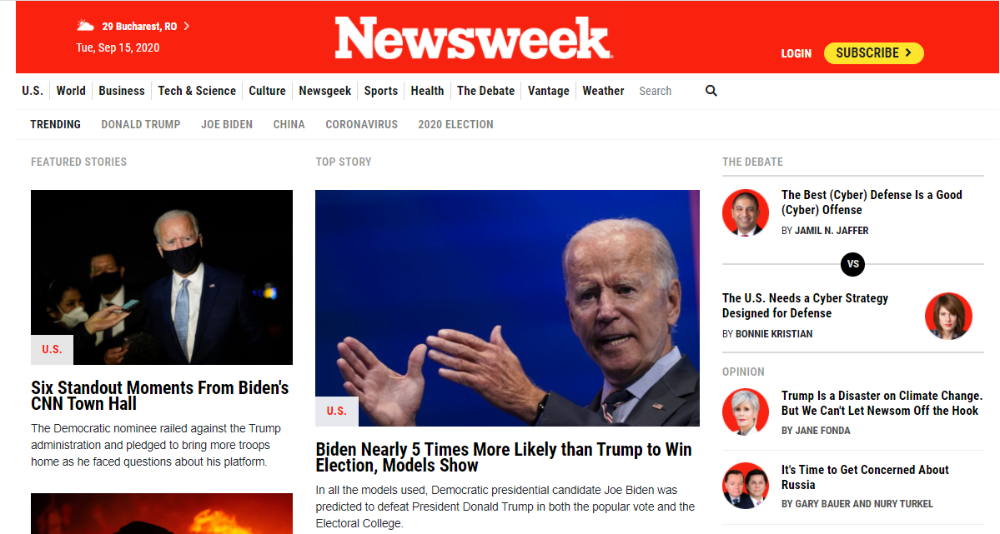

# Newsweek-Clone

> In this project we created a Newsweek clone page using Bootstrap 4. It was a good experience to learn to use Bootstrap Grid and using different components like Media objects, forms, and cards, we learnt how to configure them with bootstrap classes for the margins padding and flex positioning.

# Project Requirements
- Remember to use Bootstrap CSS classes wherever it is possible - this is the main point of this project.
- As you can use a ready set of CSS classes, be more precise and make sure that your page looks exactly the same as the source page.
- Remember to double-check that your page layout does not break on smaller screens.

## Built With

- HTML
- CSS
- Bootstrap 4
- VSCode

## Live Demo

[Live Demo Link](https://yors-git.github.io/Newsweek-Clone/)

## Authors

👤 **Lydia Ingabire**

- Github: [@DeliceLydia](https://github.com/DeliceLydia)
- Twitter: [@IngabireLydia3](https://twitter.com/IngabireLydia)
- Linkedin: [linkedin](https://www.linkedin.com/in/delice-lydia-91b55b167)

👤 **Jorge Torres**

- Github: [@Yors-git](https://github.com/Yors-git)
- Twitter: [@Yors_82](https://twitter.com/Yors_82) 

## 🤝 Contributing

Contributions, issues and feature requests are welcome!

Feel free to check the [issues page](https://github.com/Yors-git/Newsweek-Clone/issues).
