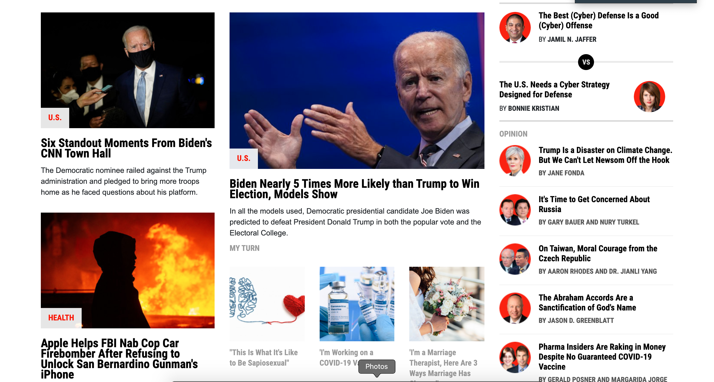

# Newsweek-Clone

> In this project we created a Newsweek clone page using Bootstrap 4.

## Built With

- HTML
- CSS
-Bootstrap 4
- VSCode

## Live Demo

[Live Demo Link](https://yors-git.github.io/Newsweek-clone/)

## Authors

👤 **Lydia Ingabire**

- Github: [@DeliceLydia](https://github.com/DeliceLydia)
- Twitter: [@IngabireLydia3](https://twitter.com/IngabireLydia)
- Linkedin: [linkedin](https://www.linkedin.com/in/delice-lydia-91b55b167)

👤 **Jorge Torres**

- Github: [@Yors-git](https://github.com/Yors-git)
- Twitter: [@Yors_82](https://twitter.com/Yors_82) 

## 🤝 Contributing

Contributions, issues and feature requests are welcome!

Feel free to check the [issues page](enter issues url here).
